# 🎯 8-Puzzle Solver – Tổng hợp thuật toán AI tìm kiếm

## 📁 Thư mục chứa GIF minh họa: `gif/`

---

## 🔍 **Thuật toán Tìm kiếm**

### 📌 Breadth-First Search (BFS)

### 📌 Depth-First Search (DFS)
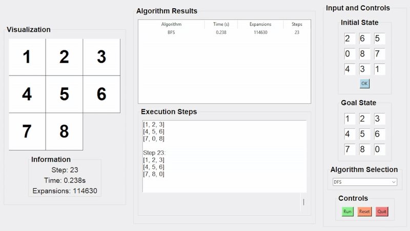

### 📌 Uniform Cost Search (UCS)
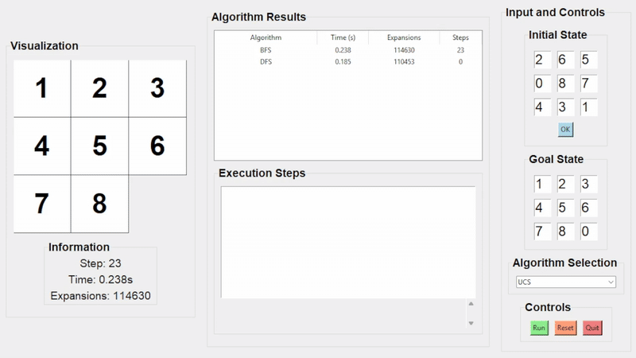

### 📌 Greedy Best-First Search
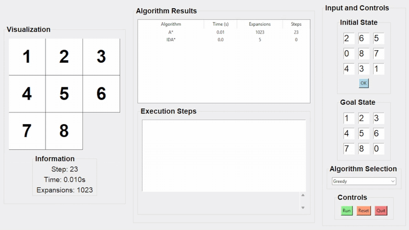

### 📌 A\* Search
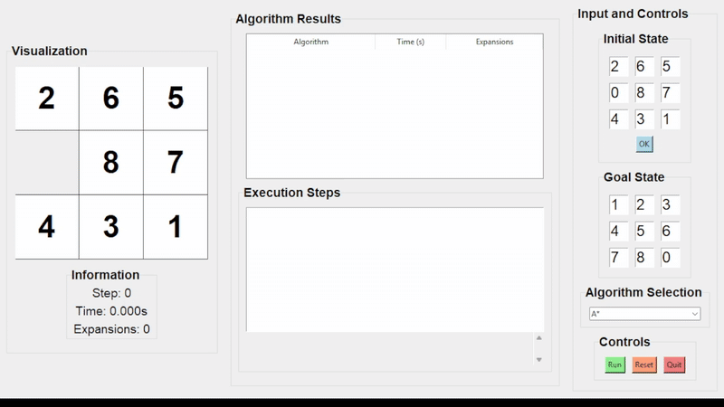

### 📌 Iterative Deepening DFS (IDDFS)
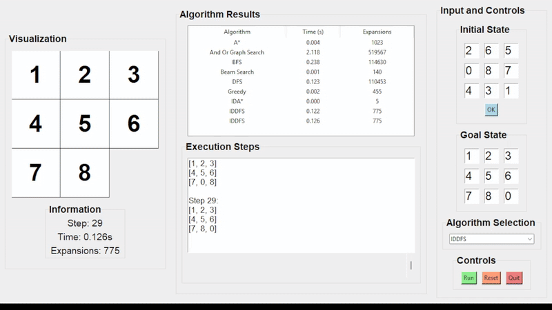

### 📌 Iterative Deepening A\* (IDA\*)
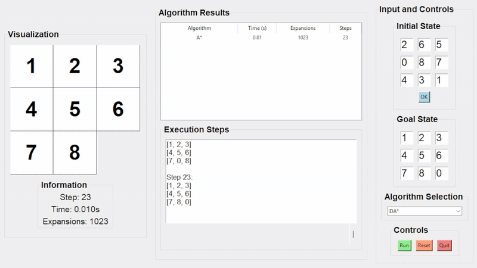

### 📌 Beam Search
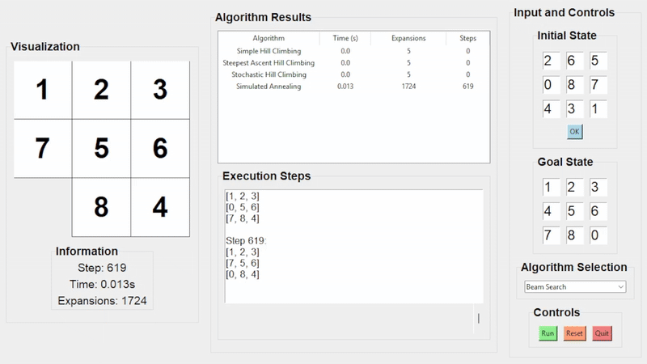

### 📌 And-Or Graph Search
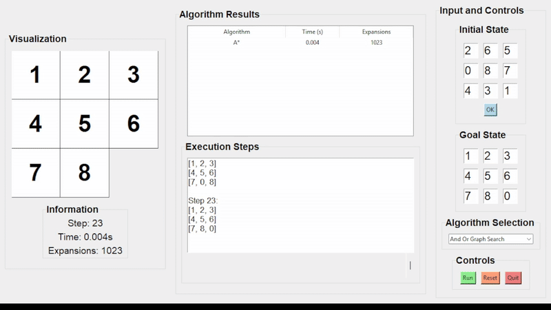

### 📌 Searching with No Observation
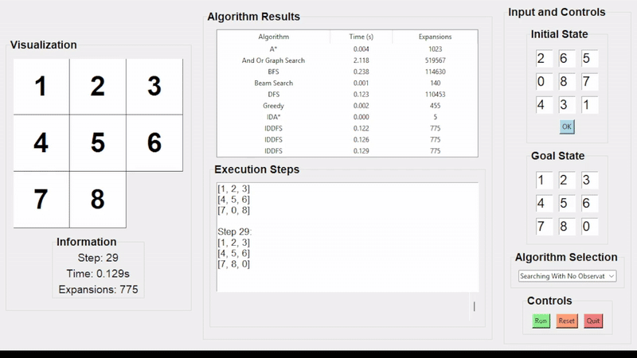

---

## 🧠 **Thuật toán Tối ưu hóa (Local Search)**

### 🏔️ Simple Hill Climbing
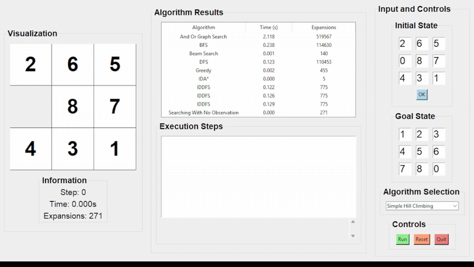

### 🏔️ Steepest-Ascent Hill Climbing
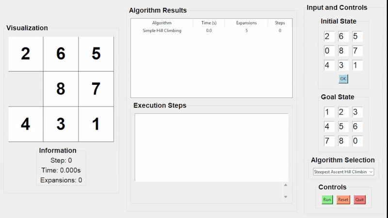

### 🎲 Stochastic Hill Climbing
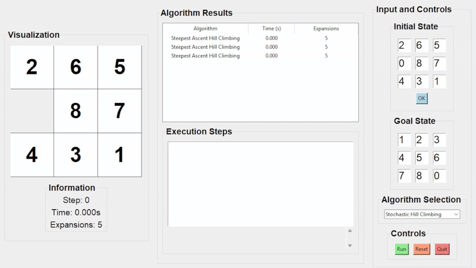

### ❄️ Simulated Annealing
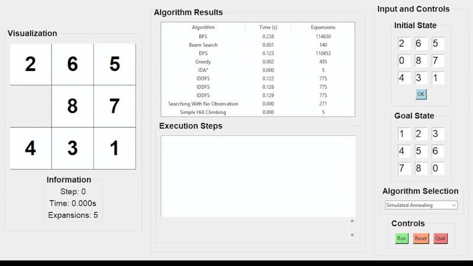
