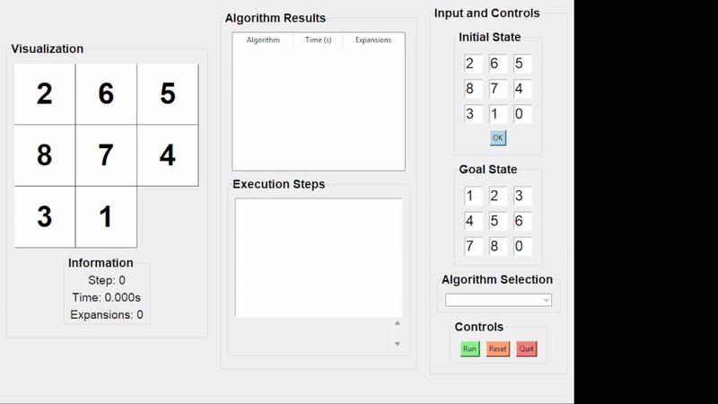
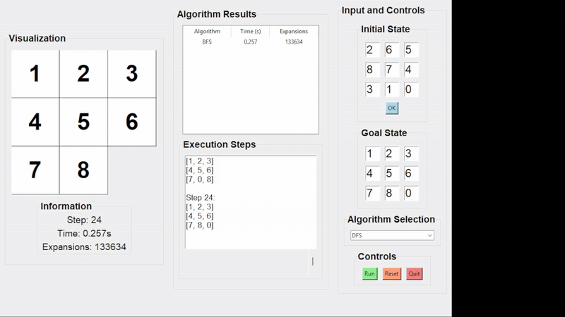
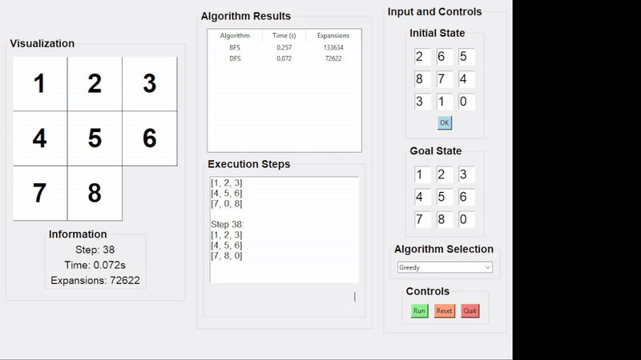
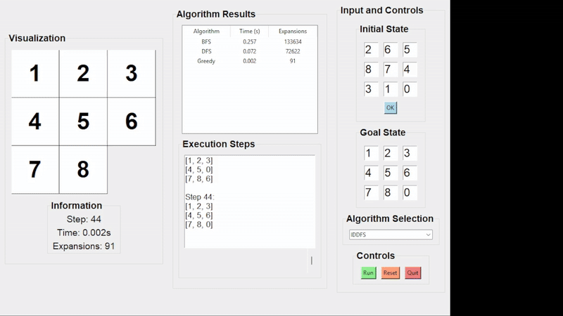
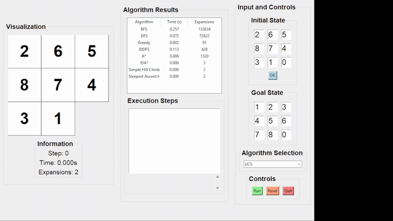
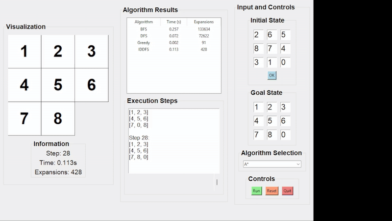
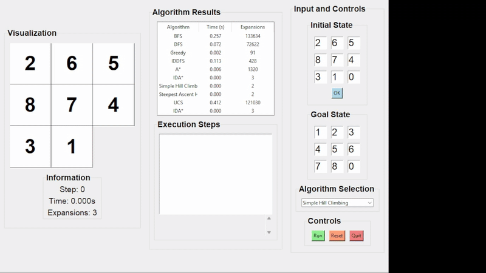
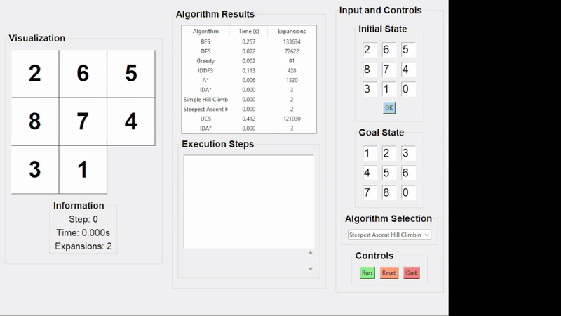

# Hình ảnh chạy thuật toán
## Thuật toán tìm kiếm
**🔍 Thuật toán BFS**  

**🔍 Thuật toán DFS**  

**🔍 Thuật toán Greedy**  

**🔍 Thuật toán IDDFS**  

**🔍 Thuật toán UCS**  

**🔍 Thuật toán A\***  

**🔍 Thuật toán IDA\***  

## Thuật toán tối ưu hóa
**🏔️ Thuật toán Simple Hill Climbing**  

**🏔️ Thuật toán Steepest Ascent Hill Climbing**  

**🏔️ Thuật toán Stochastic Hill Climbing**

**🔍 Thuật toán Simulated Annealing**

**🔍 Thuật toán Beam Search**
