# 🎯 8-Puzzle Solver – Tổng hợp thuật toán AI tìm kiếm

## 1. MỤC TIÊU
- **Ứng dụng các thuật toán Trí tuệ Nhân tạo (AI):**  
  Triển khai đa dạng các thuật toán tìm kiếm để giải bài toán 8-puzzle, từ các phương pháp cơ bản như  
  `Breadth-First Search (BFS)`, `Depth-First Search (DFS)` đến các kỹ thuật nâng cao như  
  `A*`, `Genetic Algorithm`, và `Q-Learning`.  
  Dự án thể hiện khả năng áp dụng lý thuyết AI vào thực tiễn.

- **Xây dựng giao diện trực quan và thân thiện:**  
  Giao diện người dùng (GUI) được phát triển bằng thư viện `Tkinter`, hỗ trợ:
  - Nhập trạng thái bắt đầu và trạng thái đích.
  - Lựa chọn thuật toán cần chạy.
  - Quan sát quá trình giải thông qua mô phỏng.
  Giao diện được thiết kế tối giản, dễ sử dụng và thân thiện với người học.

- **So sánh và đánh giá hiệu quả thuật toán:**  
  Hệ thống đo lường các chỉ số:
  - Thời gian thực thi (tính bằng giây).
  - Số lần mở rộng trạng thái (expansions).
  - Số bước (steps).
  Nhờ đó, người dùng có thể đánh giá ưu – nhược điểm của từng thuật toán trong các tình huống khác nhau.

- **Hỗ trợ trực quan hóa và học tập:**  
  Dự án đóng vai trò như một công cụ học thuật giúp:
  - Quan sát trực quan cách thuật toán hoạt động.
  - Củng cố kiến thức lý thuyết môn `Trí tuệ Nhân tạo`.
  - Rèn luyện kỹ năng lập trình và tư duy phân tích thông qua bài tập cá nhân.

## 🧠 2. THUẬT TOÁN ĐƯỢC TÍCH HỢP

Bài toán 8-Puzzle trong dự án được giải bằng cách tích hợp **6 nhóm thuật toán tìm kiếm**, đại diện cho các chiến lược giải quyết khác nhau trong Trí tuệ Nhân tạo:

---

### 2.1. **Uninformed Search** (*Tìm kiếm không sử dụng thông tin*)

> Ý tưởng thuật toán: Duyệt toàn bộ không gian trạng thái mà **không dùng thông tin thêm về đích**. Ưu tiên dựa vào cấu trúc của cây tìm kiếm.

- **Breadth-First Search (BFS):** Là thuật toán tìm kiếm duyệt theo tầng (lớp), mở rộng các trạng thái gần gốc nhất trước khi đi sâu vào các mức sâu hơn. BFS sử dụng cấu trúc hàng đợi (queue) hoạt động theo nguyên tắc FIFO (First In, First Out) để đảm bảo duyệt theo chiều rộng.Duyệt theo **tầng/lớp**, đảm bảo tìm được đường đi ngắn nhất nhưng tốn nhiều bộ nhớ.
  
- **Depth-First Search (DFS):** Là thuật toán duyệt theo chiến lược đi sâu tối đa vào nhánh hiện tại trước khi quay lại và duyệt các nhánh khác. DFS sử dụng cấu trúc ngăn xếp (stack) hoạt động theo nguyên tắc LIFO (Last In, First Out) để lưu trữ các trạng thái kế tiếp cần khám phá. Duyệt **sâu xuống tối đa**, ít tốn bộ nhớ nhưng có thể rơi vào vòng lặp.
  
- **Uniform Cost Search (UCS):** Là thuật toán tìm kiếm mở rộng trạng thái có tổng chi phí thấp nhất từ trạng thái ban đầu. UCS sử dụng hàng đợi ưu tiên (priority queue) để đảm bảo luôn chọn trạng thái có chi phí lũy kế nhỏ nhất. Đây là phiên bản tổng quát của BFS khi chi phí mỗi bước không đều.
  
- **Iterative Deepening DFS (IDDFS):** Là thuật toán kết hợp giữa DFS (Depth-First Search) và BFS (Breadth-First Search) bằng cách duyệt theo chiều sâu có giới hạn, sau đó lặp lại với độ sâu tăng dần. Mỗi vòng lặp là một DFS mới với giới hạn độ sâu lớn hơn trước một đơn vị.
---

### 2.2. **Informed Search** (*Tìm kiếm có sử dụng heuristic*)

> Ý tưởng thuật toán: **Hướng dẫn quá trình tìm kiếm** bằng một hàm đánh giá (heuristic) giúp lựa chọn trạng thái “hứa hẹn” hơn.

- **Greedy Search:** Là thuật toán tìm kiếm có định hướng, luôn ưu tiên mở rộng trạng thái có giá trị heuristic thấp nhất – tức là trạng thái được đánh giá là "gần đích nhất" theo một tiêu chí ước lượng. Greedy Search sử dụng hàng đợi ưu tiên (priority queue) với trọng số là hàm heuristic h(n).
  
- **A\* Search:** Là một trong những thuật toán tìm kiếm mạnh mẽ nhất, A\* sử dụng hàm đánh giá f(n) = g(n) + h(n) để lựa chọn trạng thái tiếp theo. Trong đó:
                   + g(n) là chi phí từ trạng thái bắt đầu đến trạng thái hiện tại.
                   + h(n) là ước lượng chi phí còn lại từ trạng thái hiện tại đến mục tiêu (heuristic).
                  A* sử dụng hàng đợi ưu tiên (priority queue) để mở rộng các trạng thái có giá trị f(n) thấp nhất.
  
- **Iterative Deepening A\* (IDA\*):** Là thuật toán kết hợp giữa A\* và DFS có giới hạn, nhằm khắc phục nhược điểm tiêu tốn bộ nhớ của A\*. Thay vì sử dụng hàng đợi ưu tiên để mở rộng trạng thái theo f(n) = g(n) + h(n), IDA* sẽ thực hiện tìm kiếm theo chiều sâu với ngưỡng giới hạn f(n) tăng dần qua mỗi vòng lặp.

---

### 2.3. **Local Search** (*Tìm kiếm cục bộ*)

> Ý tưởng thuật toán: Bắt đầu từ một trạng thái ban đầu và **cải thiện liên tục** dựa trên hàng xóm lân cận – không cần duyệt toàn bộ cây trạng thái.

- **Simple Hill Climbing:** Là thuật toán tìm kiếm cục bộ đơn giản, trong đó agent luôn di chuyển sang trạng thái hàng xóm có giá trị tốt hơn (tức heuristic thấp hơn). Quá trình lặp lại cho đến khi không còn trạng thái nào tốt hơn hiện tại, khi đó thuật toán dừng lại.
  
- **Steepest-Ascent Hill Climbing:** Là biến thể cải tiến của Hill Climbing, trong đó thuật toán sẽ duyệt qua tất cả các trạng thái hàng xóm hợp lệ và chọn trạng thái có **giá trị heuristic tốt nhất** (tức là thấp nhất). Quá trình lặp lại cho đến khi không còn hàng xóm nào tốt hơn trạng thái hiện tại.
  
- **Stochastic Hill Climbing:** Là biến thể của Hill Climbing trong đó thuật toán không chọn hàng xóm tốt nhất, mà thay vào đó sẽ **chọn ngẫu nhiên một hàng xóm tốt hơn** trạng thái hiện tại. Điều này giúp tăng tính đa dạng trong tìm kiếm và giảm khả năng mắc kẹt tại cực trị cục bộ.
  
- **Simulated Annealing:** Là thuật toán tìm kiếm cục bộ lấy cảm hứng từ quá trình luyện kim, khi kim loại được nung nóng rồi làm nguội chậm để đạt trạng thái ổn định tối ưu. Tương tự, thuật toán **chấp nhận cả những trạng thái xấu hơn** trạng thái hiện tại với một xác suất nhất định, nhằm **tránh kẹt tại cực trị cục bộ**. Xác suất này giảm dần theo thời gian (theo nhiệt độ), giúp tìm kiếm dần hội tụ.
  
- **Beam Search:** Là phiên bản cải tiến của BFS với giới hạn, trong đó tại mỗi bước mở rộng, thuật toán chỉ **giữ lại k trạng thái có giá trị heuristic tốt nhất** thay vì mở rộng toàn bộ. Tham số k (gọi là **beam width**) đóng vai trò như “tia sáng”, giúp thu hẹp phạm vi tìm kiếm để **cân bằng giữa hiệu quả và độ chính xác**.
  
- **Genetic Algorithm:** Là thuật toán tìm kiếm mô phỏng quá trình **chọn lọc tự nhiên** trong sinh học. Thuật toán bắt đầu với một quần thể các lời giải ngẫu nhiên, sau đó lặp lại các quá trình như **lựa chọn (selection)**, **lai ghép (crossover)** và **đột biến (mutation)** để tạo ra các thế hệ mới. Qua nhiều vòng lặp, quần thể dần tiến hóa đến lời giải tốt hơn.
---

### 2.4. **Constraint Satisfaction Problem (CSP)** (*Bài toán ràng buộc*)

> Ý tưởng thuật toán: Biểu diễn bài toán bằng **biến, miền giá trị, và ràng buộc** giữa các biến. Mục tiêu là tìm gán giá trị **thoả mãn toàn bộ ràng buộc**.

- **Backtracking Search:** Là thuật toán giải bài toán ràng buộc bằng cách **gán giá trị cho từng biến một cách tuần tự**, và quay lui (**backtrack**) nếu phát hiện xung đột với các ràng buộc đã đặt. Quá trình tiếp tục cho đến khi tìm được một phép gán đầy đủ thỏa mãn tất cả các ràng buộc hoặc xác định rằng không có lời giải.
  
- **Backtracking with AC-3:** Là phiên bản mở rộng của backtracking, trong đó kết hợp với thuật toán **AC-3** (**Arc Consistency 3**) để **lọc ràng buộc** trước và trong quá trình gán giá trị. AC-3 loại bỏ các giá trị không hợp lệ trong miền của biến, giúp *giảm không gian tìm kiếm** và tránh được nhiều nhánh sai.

- **Trial-and-Error:** Là phương pháp giải bài toán CSP bằng cách **gán ngẫu nhiên các giá trị hợp lệ** cho các biến, sau đó kiểm tra toàn bộ ràng buộc. Quá trình được lặp lại nhiều lần với các tổ hợp khác nhau cho đến khi tìm được một lời giải **thoả mãn tất cả ràng buộc**, hoặc đạt đến số lần thử giới hạn.
---

### 2.5. **Complex Environment Search** (*Tìm kiếm trong môi trường không chắc chắn*)

> Ý tưởng thuật toán: Dành cho các môi trường **không quan sát đầy đủ**, hoặc có **kết quả hành động không xác định**.

- **AND-OR Graph Search:** Là thuật toán tìm kiếm được thiết kế cho **môi trường không xác định**, nơi một hành động có thể dẫn đến nhiều kết quả khác nhau. Thuật toán xây dựng một **cây kế hoạch** (plan tree), trong đó:
                  + Nút OR đại diện cho **lựa chọn hành động** tại mỗi trạng thái.
                  + Nút AND đại diện cho việc phải **xử lý tất cả các kết quả có thể xảy ra** từ một hành động.
  
- **No Observation Search:** Là thuật toán được thiết kế cho các môi trường không có khả năng **quan sát trạng thái hiện tại**. Agent bắt đầu với một tập hợp tất cả các **trạng thái khả dĩ** và chỉ sử dụng **logic hành động** để thu hẹp dần tập trạng thái niềm tin (belief state). Vì không có cảm biến hay tín hiệu phản hồi từ môi trường, thuật toán phải đảm bảo rằng kế hoạch tìm được sẽ đưa agent đến trạng thái mục tiêu bất kể trạng thái ban đầu thực sự là gì.

- **Belief State Search (Belief BFS):** Là thuật toán tìm kiếm hoạt động trên **tập hợp các trạng thái có thể** (belief state) thay vì một trạng thái cụ thể. Thuật toán mô phỏng cách agent suy luận khi **môi trường không quan sát đầy đủ**, bằng cách duy trì và cập nhật một tập hợp trạng thái có thể đang tồn tại. Ở mỗi bước, một hành động được áp dụng đồng thời lên toàn bộ tập trạng thái, sau đó cập nhật tập belief state mới. Quá trình lặp lại cho đến khi ít nhất một trạng thái trong tập **trùng với trạng thái mục tiêu**.

---

### 2.6. **Reinforcement Learning & Evolutionary Algorithms**

> Ý tưởng thuật toán: Không có thuật toán tìm kiếm cụ thể, thay vào đó là **tự học qua tương tác với môi trường** hoặc **tiến hóa qua thế hệ**.

- **Q-Learning:** Là thuật toán học tăng cường (reinforcement learning) theo mô hình **không cần biết trước môi trường** (model-free). Q-Learning cho phép agent học giá trị của từng hành động trong từng trạng thái thông qua tương tác với môi trường, từ đó dần hình thành **chính sách hành động tối ưu**. Thuật toán duy trì một bảng Q lưu giá trị Q(s, a), tức giá trị kỳ vọng khi thực hiện hành động a tại trạng thái s, sau đó đi theo chính sách tốt nhất. Q được cập nhật dần theo công thức dựa trên phần thưởng thu được và ước lượng tương lai.
 

---
## 3. Thực nghiệm

Dưới đây là kết quả thực nghiệm chạy các thuật toán trên nhiều cấu hình đầu vào khác nhau. Mỗi thuật toán được đo:
- ⏱️ Thời gian thực thi (giây)
- 🔄 Số lần mở rộng trạng thái (expansions)

---
### 3.1. Thuật toán tìm kiếm không có thông tin (Uninformed Search)
#### Thành phần chính
- **Trạng thái đầu**: là một danh sách gồm 9 phần tử được nhập từ người dùng, từ 0 đến 8 (0 là ô trống) được hiển thị dưới dạng lưới 3x3. Ví dụ [2, 6, 5, 0, 8, 7, 4, 3, 1]
- **Trạng thái mục tiêu**: Trạng thái mà các ô được sắp xếp theo thứ tự tăng dần từ trái sang phải, từ trên xuống dưới, với ô trống (0) ở góc dưới cùng bên phải. Cụ thể: [1, 2, 3, 4, 5, 6, 7, 8, 0]
- **Không gian trạng thái**: 8-Puzzle gồm 8 ô số (1–8) và 1 ô trống (0) trên lưới 3×3. Tổng số cấu hình khác nhau của các ô là: 9!=362,880 trạng thái khác nhau. Tuy nhiên, chỉ có 9!/2 = 181,440 trạng thái hợp lệ.
- **Hành động**: Di chuyển ô trống theo 4 hướng: lên, xuống, trái, phải để tạo ra các trạng thái tiếp theo.
- **Hàm chi phí**: Mỗi hành động di chuyển có chi phí là 1.
- **Đặc điểm**: Không sử dụng hàm heuristic, dựa hoàn toàn vào cấu trúc không gian trạng thái.
#### 📌 Breadth-First Search (BFS)

#### 📌 Depth-First Search (DFS)

#### 📌 Uniform Cost Search (UCS)

#### 📌 Iterative Deepening DFS (IDDFS)

#### So sánh kết quả các thuật toán
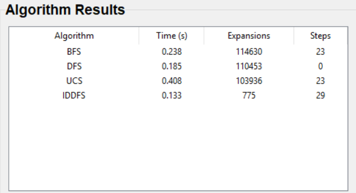

    - BFS: Tìm được đường đi ngắn nhất nhưng tốn nhiều bộ nhớ
    - DFS: Do duyệt theo chiều sau nên khó tránh khỏi vòng lặp, không tìm được đường đi
    - USC: Đảm bảo tối ưu về chi phí, nhưng tốn nhiều tài nguyên
    - IDDFS: Tối ưu nhất, rất phù hợp
#### Nhận xét
##### Ưu điểm
    - Ưu điểm
    -  BFS: Đảm bảo tìm được lời giải ngắn nhất nếu chi phí các bước bằng nhau, thực hiện đơn giản, hiệu quả với lời giải ngắn.
    -  DFS: Tiết kiệm bộ nhớ hơn BFS, có thể tìm lời giải nhanh nếu lời giải nằm sâu, cài đặt dễ
    -  UCS: Đảm bảo tìm được đường đi tối ưu, thích hợp khi các hành động có chi phí khác nhau
    -  IDDFS: Kết hợp ưu điểm của DFS và BFS, tiết kiệm bộ nhớ như DFS và đảm bảo tìm lời giải tối ưu nếu chi phí đều
##### Nhược điểm
    - BFS và UCS sẽ gây tốn bộ nhớ do phải lưu tất cả trạng thái ở mỗi mức.
    - DFS không đảm bảo tối ưu có thể không giải được nếu nhánh sâu vô tận và giới hạn độ sâu không hợp lý.
    - IDDFS khi áp dụng lại chưa cho hiệu năng tốt nhất do hạn chế của DLS khi giới hạn độ sâu, hoặc đồ thị có chu trình.

### 3.2. Thuật toán tìm kiếm không thông tin (Informed Search)
#### Thành phần chính
- **Trạng thái đầu**: là một danh sách gồm 9 phần tử được nhập từ người dùng, từ 0 đến 8 (0 là ô trống) được hiển thị dưới dạng lưới 3x3. Ví dụ [2, 6, 5, 0, 8, 7, 4, 3, 1]
- **Trạng thái mục tiêu**: Trạng thái mà các ô được sắp xếp theo thứ tự tăng dần từ trái sang phải, từ trên xuống dưới, với ô trống (0) ở góc dưới cùng bên phải. Cụ thể: [1, 2, 3, 4, 5, 6, 7, 8, 0]
- **Không gian trạng thái**: 8-Puzzle gồm 8 ô số (1–8) và 1 ô trống (0) trên lưới 3×3. Tổng số cấu hình khác nhau của các ô là: 9!=362,880 trạng thái khác nhau. Tuy nhiên, chỉ có 9!/2 = 181,440 trạng thái hợp lệ.
- **Hành động**: Di chuyển ô trống theo 4 hướng: lên, xuống, trái, phải để tạo ra các trạng thái tiếp theo.
- **Hàm chi phí**: Mỗi hành động di chuyển có chi phí là 1.
- **Đặc điểm**: Sử dụng hàm heuristic, để hướng dẫn tìm kiếm không gian trạng thái.
### 📌 A\* Search

#### 📌 Greedy Best-First Search

#### 📌 Iterative Deepening A\* (IDA\*)

#### So sánh kết quả các thuật toán
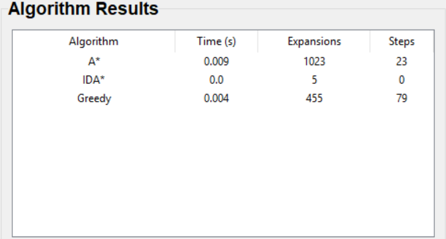

    - A\*: Tìm được đường đi ngắn nhất, nhưng tiêu hao nhiều tài nguyên
    - IDA\*: Không tìm được đường đi.
    - Greedy: Đường đi không phải ngắn nhất, nhưng tiết kiệm tài nguyên
#### Nhận xét
##### Ưu điểm
    - Ưu điểm
    -  A*: Tìm được lời giải tối ưu nếu heuristic chấp nhận được, cân bằng giữa chi phí thực tế và ước lượng, tốc độ tốt trong nhiều bài toán
    -  Greedy: Nhanh do chỉ dựa vào heuristic, hiệu quả trong không gian lớn với heuristic tốt, tốn bộ nhớ ít hơn A*
    -  IDA*: Tiết kiệm bộ nhớ hơn A* (giống DFS), giữ được tính tối ưu như A* nếu heuristic tốt, phù hợp với không gian trạng thái lớn.
##### Nhược điểm
    - A*: Tốn nhiều bộ nhớ do lưu cả đường đi và hàng đợi ưu tiên
    - Greedy: Không đảm bảo tìm ra lời giải tối ưu, có thể đi sai hướng, dễ mắc kẹt
    - IDA*: Chậm hơn A* do phải lặp lại nhiều lần, điểm yếu sẽ lộ rõ khi gặp những bài có nhánh sâu vô tận hoặc đồ thị có chu trình.

### 3.3. Thuật toán tìm kiếm có ràng buộc (Constraint Satisfaction Problem)
#### Thành phần chính
- **Biến**: Gồm 9 biến tương ứng với 9 vị trí trong lưới 3x3, đặt tên là X0, X1, ..., X8. Mỗi biến đại diện cho một ô trong lưới (vị trí trên bảng).
- **Miền giá trị**: Mỗi biến có giá trị từ 0 đến 8 với 0 là ô trống, các biến không được trùng lặp các giá trị với nhau. Có thể sắp xếp ngẫu nhiên.
- **Không gian trạng thái**: 8-Puzzle gồm 8 ô số (1–8) và 1 ô trống (0) trên lưới 3×3. Tổng số cấu hình khác nhau của các ô là: 9!=362,880 trạng thái khác nhau. Tuy nhiên, chỉ có 9!/2 = 181,440 trạng thái hợp lệ.
- **Ràng buộc**:
     - **Ràng buộc ngang**: Các ô liền kề theo chiều ngang (X1-X2, X2-X3) phải thỏa mãn: giá trị của ô bên phải lớn hơn giá trị ô bên trái 1 đơn vị và ô bên trái không phải là 0.
     - **Ràng buộc dọc**: Các ô liền kề theo chiều dọc (X1-X4, X2-X2) phải thỏa mãn: giá trị của ô bên dưới lớn hơn giá trị ô bên trên 3 đơn vị và ô bên trên không phải là 0.
     - **Ràng buộc không trùng giá trị**: Mỗi biến phải nhận 1 giá trị duy nhất.
- **Kiểm tra khả năng**: Kiểm tra xem một giá trị có vi phạm ràng buộc với các biến đã được gán hay không
- **Đặc điểm**
    - Backtracking CSP và Trial And Error gán ngẫu nhiên giá trị cho các biến và quay lui để tìm lời giải.
    - Backtracking AC3 giảm miền giá trị bằng AC3 sau đó mới áp dụng backtracking, giúp giảm số lần quay lui
#### 📌 Backtracking Search

#### 📌 Backtracking With AC3
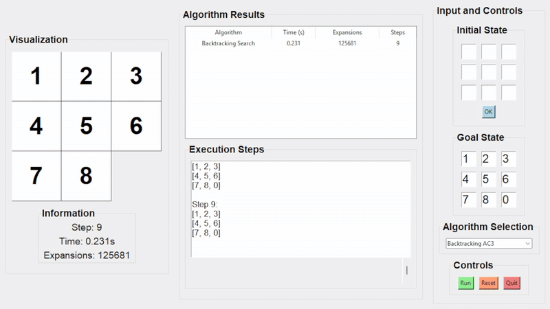

#### 📌 Trial and Error
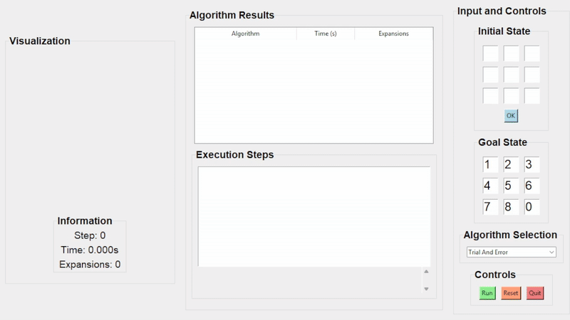

#### So sánh kết quả các thuật toán
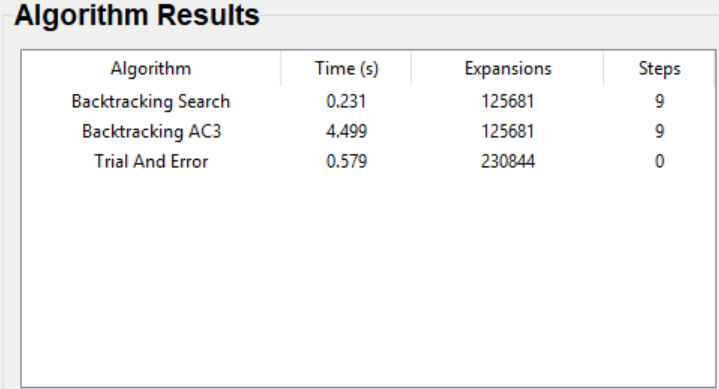

    - Backtracking: Tìm được lời giải, tốc độ nhanh nhưng số lần mở rộng nhiều.
    - Backtracking with AC3: Cũng tìm được lời giải, nhưng tốc độ chậm hơn đáng kể do mất thời gian xử lý các ràng buộc bằng thuật toán AC3. Tuy vậy, số lần mở rộng không giảm so với Backtracking vì bài toán 8-Puzzle vốn không có nhiều ràng buộc loại trừ để AC3 phát huy hiệu quả.
    - Trial and Error: Tìm được kết quả, nhưng tốn nhiều tài nguyên.
#### Nhận xét
##### Ưu điểm
    - Ưu điểm
    -  Backtracking search: Cài đặt đơn giản, đảm bảo tìm được lời giải nếu tồn tại, phù hợp với các bài toán ràng buộc nhỏ.
    -  Backtracking with AC3: `Giảm không gian tìm kiếm` nhờ lọc ràng buộc trước, tránh nhiều nhánh sai ngay từ đầu.
    -  Trial and Error: Cách tiếp cận ngẫu nhiên, dễ cài đặt. Thích hợp để tạo trạng thái hợp lệ hoặc kiểm thử
##### Nhược điểm
    - Backtracking search: Dễ rơi vào quay lui sâu khi không có hướng dẫn. Hiệu suất thấp nếu không kết hợp chiến lược chọn biến hay gán giá trị
    - Backtracking with AC3:Cần thêm chi phí tính toán trước. Không phù hợp nếu ràng buộc quá đơn giản.
    - Trial and Error: Không đảm bảo tìm ra lời giải. Kém hiệu quả nếu không giới hạn số lần thử.

### 3.4. Thuật toán tìm kiếm cục bộ (Local Search)
#### Thành phần chính
- **Trạng thái đầu**: là một danh sách gồm 9 phần tử được nhập từ người dùng, từ 0 đến 8 (0 là ô trống) được hiển thị dưới dạng lưới 3x3. Ví dụ [2, 6, 5, 0, 8, 7, 4, 3, 1]
- **Trạng thái mục tiêu**: Trạng thái mà các ô được sắp xếp theo thứ tự tăng dần từ trái sang phải, từ trên xuống dưới, với ô trống (0) ở góc dưới cùng bên phải. Cụ thể: [1, 2, 3, 4, 5, 6, 7, 8, 0]
- **Không gian trạng thái**: 8-Puzzle gồm 8 ô số (1–8) và 1 ô trống (0) trên lưới 3×3. Tổng số cấu hình khác nhau của các ô là: 9!=362,880 trạng thái khác nhau. Tuy nhiên, chỉ có 9!/2 = 181,440 trạng thái hợp lệ.
- **Hành động**: Di chuyển ô trống theo 4 hướng: lên, xuống, trái, phải để tạo ra các trạng thái tiếp theo.
- Sử dụng **Mahattan Distance** để tính tổng khoảng cách di chuyển của mỗi ô từ vị trí hiện tại (x1, y1) đến vị trí trạng thái mục tiêu (x2, y2), với công thức là |x1 - x2| + |y1 - y2|
- **Hàm chi phí**: Mỗi hành động di chuyển có chi phí là 1.
#### 📌 Beam Search

#### 🏔️ Simple Hill Climbing

#### 🏔️ Steepest-Ascent Hill Climbing

#### 🎲 Stochastic Hill Climbing

#### ❄️ Simulated Annealing

#### 📌 Genetic Algorithm
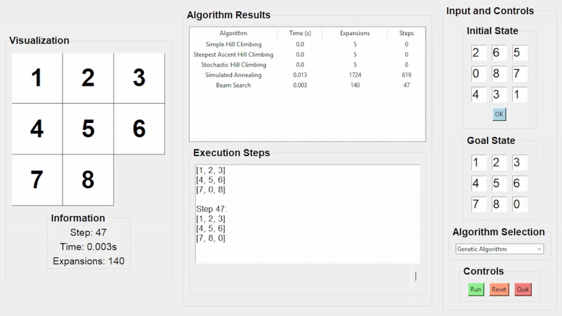
#### So sánh kết quả các thuật toán
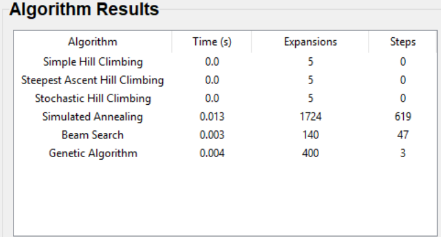

    - Simple / Steepest / Stochastic Hill Climbing: Không tìm được lời giải, vì dễ rơi vào cực trị cục bộ mà không có chiến lược thoát.
    - Simulated Annealing: tìm được lời giải nhưng số bước rất lớn (619 bước) do khả năng thoát khỏi cực trị cục bộ tốt nhờ cho phép chọn trạng thái xấu hơn có xác suất giảm dần
    - Beam Search: Hiệu quả cao chỉ cần mở 140 node, đạt được lời giải với 47 bước.
    - Genetic Algorithm: Tìm được lời giải rất ngắn chỉ sau 400 lần mở rộng.
#### Nhận xét
##### Ưu điểm
    - Ưu điểm
    - Simple Hill Climbing: Tốc độ nhanh, dễ triển khai, hiệu quả khi lời giải nằm gần trạng thái khởi đầu.
    - Steepest-Ascent Hill Climbing: Luôn chọn hàng xóm tốt nhất, giúp tăng khả năng thoát khỏi cực trị cục bộ so với phương pháp đơn giản.
    - Stochastic Hill Climbing: Tăng tính đa dạng bằng cách chọn ngẫu nhiên một hàng xóm tốt hơn, giảm nguy cơ mắc kẹt ở điểm cục bộ.
    - Simulated Annealing: Mô phỏng quá trình luyện kim, cho phép chấp nhận trạng thái kém hơn trong ngắn hạn để vượt qua cực trị cục bộ, phù hợp với các bài toán khó.
    - Beam Search: Cân bằng giữa hiệu quả và tốc độ bằng cách chỉ mở rộng một số trạng thái hứa hẹn nhất tại mỗi bước thay vì duyệt toàn bộ.
    - Genetic Algorthm: Tìm kiếm toàn cục, tránh được kẹt ở cực trị cục bộ. Phù hợp với không gian trạng thái lớn, có thể xử lý bài toán phức tạp và không tuyến tính.
##### Nhược điểm
    - Simple Hill Climbing: Dễ rơi vào cực trị cục bộ do chỉ quan tâm đến cải thiện trước mắt, không đánh giá toàn bộ không gian lân cận.
    - Steepest-Ascent Hill Climbing: Dù đánh giá toàn bộ hàng xóm nhưng vẫn có nguy cơ mắc kẹt tại điểm cực trị, đồng thời tốn nhiều chi phí mở rộng hơn so với phiên bản đơn giản.
    - Stochastic Hill Climbing: Kết quả phụ thuộc vào lựa chọn ngẫu nhiên nên thiếu tính ổn định, có thể không tái tạo được lời giải tốt trong các lần chạy khác nhau.
    - Simulated Annealing: Yêu cầu tinh chỉnh các tham số như nhiệt độ và hệ số làm nguội để đạt hiệu quả tối ưu, nếu không có thể giải kém.
    - Beam Search: Nếu giá trị beam_width quá nhỏ, có thể bỏ qua những hướng đi tốt, dẫn đến lời giải kém tối ưu.
    - Genetic Algorthm: Dễ bị hội tụ sớm nếu không có chiến lược đa dạng hoá quần thể. Cần nhiều chu kỳ thế hệ mới đạt kết quả tốt, tiêu tốn thời gian tính toán.

### 3.5. Thuật toán tìm kiếm môi trường phức tạp (Searching in complex environments)
#### Thành phần chính
- **Trạng thái**: Một tập hợp các trạng thái niềm tin (belief state), biểu diễn tất cả trạng thái có thể của bài toán. Ví dụ: [2, 6, 5]
- **Không gian trạng thái**: 
- **Hành động**: Một hành động (ví dụ: di chuyển ô trống) được áp dụng đồng thời cho tất cả trạng thái trong tập hợp. Sau khi thực hiện, kết quả là tập hợp trạng thái mới.
- **Kiểm tra mục tiêu**: Ít nhất một trạng thái trong tập hợp ban đầu khớp với một trạng thái mục tiêu, ví dụ: (1, 2, 3, 4, 5, 6, 7, 8, 0).
- **Đặc điểm**: Môi trường không xác định hoặc quan sát không đầy đủ, yêu cầu xử lý nhiều trạng thái cùng lúc.
#### 📌 And-Or Graph Search

#### 📌 Belief State Search (Belief BFS)
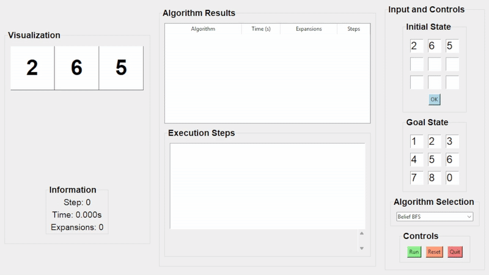
#### 📌 Searching with No Observation

#### So sánh kết quả các thuật toán
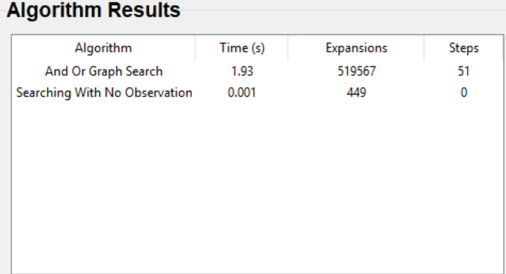
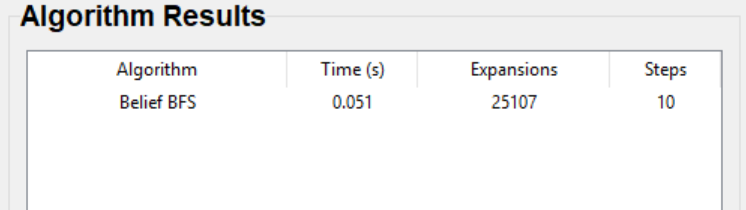

    - And-Or Graph Search: Tìm được lời giải với 51 bước. Thời gian và số node mở rộng rất lớn, do phải xử lý toàn bộ các nhánh AND và OR trong cây kế hoạch.
    - Searching With No Observation: Không tìm thất lời giải.
    - Belief-State BFS: Tìm được lời giải, số lượng mở rộng tương đối nhiều (25107), do mỗi bước xử lý cả một tập trạng thái.
#### Nhận xét
##### Ưu điểm
    - Ưu điểm
    -  AND-OR Search: Có khả năng xử lý linh hoạt trong môi trường không xác định, phù hợp với các bài toán mà mỗi hành động có thể dẫn đến nhiều kết quả khác nhau.
    -  Sensorless Search (No Observation): Đảm bảo tìm được lời giải cho mọi trạng thái khởi đầu có thể, ngay cả khi không có thông tin quan sát từ môi trường.
    -  Belief-State BFS: Hiệu quả hơn Sensorless Search trong nhiều trường hợp vì tận dụng được thông tin quan sát một phần.
##### Nhược điểm
    - AND-OR Search: Phức tạp về mặt triển khai và tốn tài nguyên do cần duyệt toàn bộ các nhánh AND và OR, đòi hỏi tính toán đệ quy và phân nhánh rộng
    - Sensorless Search (No Observation): Tốc độ chậm vì phải xử lý toàn bộ không gian trạng thái khả dĩ, do không có dữ liệu quan sát hỗ trợ.
    -  Belief-State BFS: Khi số lượng trạng thái niềm tin lớn, thuật toán sẽ tiêu tốn bộ nhớ đáng kể, ảnh hưởng đến hiệu suất và khả năng mở rộng.
    
### 3.6. Học tăng cường (Reinforcement Learning)
- **Trạng thái đầu**: là một danh sách gồm 9 phần tử được nhập từ người dùng, từ 0 đến 8 (0 là ô trống) được hiển thị dưới dạng lưới 3x3. Ví dụ [1, 6, 2, 5, 0, 3, 4, 7, 8]
- **Không gian trạng thái**: 8-Puzzle gồm 8 ô số (1–8) và 1 ô trống (0) trên lưới 3×3. Tổng số cấu hình khác nhau của các ô là: 9!=362,880 trạng thái khác nhau. Tuy nhiên, chỉ có 9!/2 = 181,440 trạng thái hợp lệ.
- **Hành động**: Di chuyển ô trống theo 4 hướng: lên, xuống, trái, phải để tạo ra các trạng thái tiếp theo.
- **Phần thưởng**: +100 nếu đạt trạng thái mục tiêu, -1 cho mỗi bước di chuyển, 0 cho các trường hợp khác.
- **Bảng Q**: lưu trữ giá trị Q(s, a), thể hiện giá trị kỳ vọng khi thực hiện hành động a tại trạng thái s, sau đó đi theo chính sách tối ưu. Agent sử dụng bảng Q để dần học cách hành xử sao cho tối đa hóa phần thưởng tích lũy.
    - Giá trị Q được cập nhật theo công thức học tăng cường:
    Qₜ(s, a) = Qₜ₋₁(s, a) + α · TDₜ(s, a)
    Trong đó:
    Qₜ(s, a): Giá trị Q mới tại thời điểm t cho trạng thái s và hành động a.
    Qₜ₋₁(s, a): Giá trị Q cũ trước đó.
    α (alpha): Hệ số học (learning rate), với 0 < α ≤ 1, xác định mức độ cập nhật Q mới.
    TDₜ(s, a): Sai số thời gian tạm thời (TD error), đại diện cho chênh lệch giữa giá trị kỳ vọng và thực tế, thường được tính bằng:
#### 📌 Q-Learning
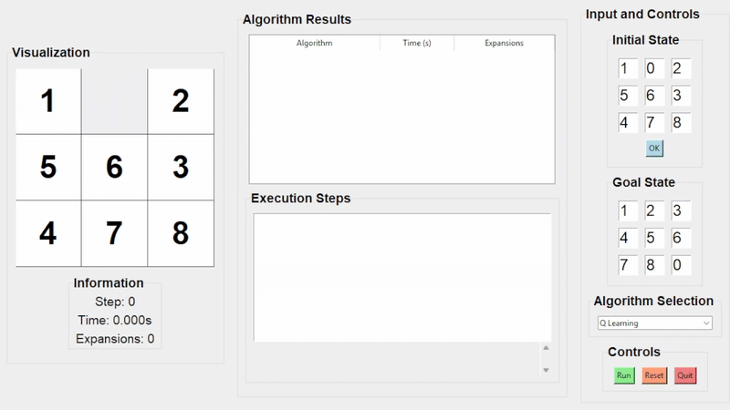

    - Q-learning: Tìm được lời giải, tối ưu thời gian và bộ nhớ.
#### So sánh kết quả các thuật toán
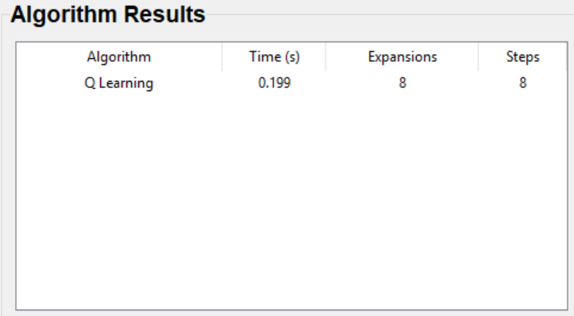
#### Nhận xét
##### Ưu điểm
    - Ưu điểm
    -  Q-learning: Tự động học chính sách tối ưu thông qua trải nghiệm, không cần mô hình môi trường, Hiệu quả với các môi trường có trạng thái hữu hạn và xác định rõ ràng như game 8-Puzzle.
##### Nhược điểm
    - Q-learning: Yêu cầu số lần lặp (episode) lớn để hội tụ, đặc biệt khi không gian trạng thái rộng. Phụ thuộc vào việc thiết kế hàm phần thưởng phù hợp. Cần điều chỉnh tốt các tham số như: learning rate, discount factor, epsilon..
---

## 👤 Tác giả

- **Vũ Quốc Trung**  
- **MSSV:** 23110353
- **Môn học:** Trí Tuệ Nhân Tạo  
- **Trường:** Đại học Sư phạm Kỹ thuật TP.HCM (HCMUTE)  
---
