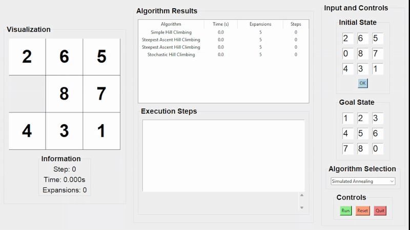

# 🎯 8-Puzzle Solver – Tổng hợp thuật toán AI tìm kiếm

## 1. MỤC TIÊU
- **Ứng dụng các thuật toán Trí tuệ Nhân tạo (AI):**  
  Triển khai đa dạng các thuật toán tìm kiếm để giải bài toán 8-puzzle, từ các phương pháp cơ bản như  
  `Breadth-First Search (BFS)`, `Depth-First Search (DFS)` đến các kỹ thuật nâng cao như  
  `A*`, `Genetic Algorithm`, và `Q-Learning`.  
  Dự án thể hiện khả năng áp dụng lý thuyết AI vào thực tiễn.

- **Xây dựng giao diện trực quan và thân thiện:**  
  Giao diện người dùng (GUI) được phát triển bằng thư viện `Tkinter`, hỗ trợ:
  - Nhập trạng thái bắt đầu và trạng thái đích.
  - Lựa chọn thuật toán cần chạy.
  - Quan sát quá trình giải thông qua mô phỏng.
  - Điều chỉnh tốc độ hiển thị.
  - Xuất kết quả ra file `.csv`.  
  Giao diện được thiết kế tối giản, dễ sử dụng và thân thiện với người học.

- **So sánh và đánh giá hiệu quả thuật toán:**  
  Hệ thống đo lường các chỉ số:
  - Thời gian thực thi (tính bằng giây).
  - Số lần mở rộng trạng thái (expansions).  
  Nhờ đó, người dùng có thể đánh giá ưu – nhược điểm của từng thuật toán trong các tình huống khác nhau.

- **Hỗ trợ trực quan hóa và học tập:**  
  Dự án đóng vai trò như một công cụ học thuật giúp:
  - Quan sát trực quan cách thuật toán hoạt động.
  - Củng cố kiến thức lý thuyết môn `Trí tuệ Nhân tạo`.
  - Rèn luyện kỹ năng lập trình và tư duy phân tích thông qua bài tập cá nhân.

## 🧠 2. THUẬT TOÁN ĐƯỢC TÍCH HỢP

Bài toán 8-Puzzle trong dự án được giải bằng cách tích hợp **6 nhóm thuật toán tìm kiếm**, đại diện cho các chiến lược giải quyết khác nhau trong Trí tuệ Nhân tạo:

---

### 2.1. **Uninformed Search** (*Tìm kiếm không sử dụng thông tin*)

> Ý tưởng thuật toán: Duyệt toàn bộ không gian trạng thái mà **không dùng thông tin thêm về đích**. Ưu tiên dựa vào cấu trúc của cây tìm kiếm.

- **Breadth-First Search (BFS):** Duyệt theo **tầng/lớp**, đảm bảo tìm được đường đi ngắn nhất nhưng tốn nhiều bộ nhớ.
- **Depth-First Search (DFS):** Duyệt **sâu xuống tối đa**, ít tốn bộ nhớ nhưng có thể rơi vào vòng lặp.
- **Uniform Cost Search (UCS):** Luôn mở rộng trạng thái có **chi phí thấp nhất** tính đến hiện tại.
- **Iterative Deepening DFS (IDDFS):** Kết hợp ưu điểm của BFS và DFS bằng cách lặp DFS với độ sâu tăng dần.

---

### 2.2. **Informed Search** (*Tìm kiếm có sử dụng heuristic*)

> Ý tưởng thuật toán: **Hướng dẫn quá trình tìm kiếm** bằng một hàm đánh giá (heuristic) giúp lựa chọn trạng thái “hứa hẹn” hơn.

- **Greedy Search:** Luôn chọn trạng thái có giá trị heuristic thấp nhất (nhanh nhưng có thể không tối ưu).
- **A\* Search:** Cân bằng giữa chi phí đi qua và heuristic (`f(n) = g(n) + h(n)`) để tìm đường đi tối ưu.
- **Iterative Deepening A\* (IDA\*):** Kết hợp A\* với duyệt theo độ sâu để tiết kiệm bộ nhớ.

---

### 2.3. **Local Search** (*Tìm kiếm cục bộ*)

> Ý tưởng thuật toán: Bắt đầu từ một trạng thái ban đầu và **cải thiện liên tục** dựa trên hàng xóm lân cận – không cần duyệt toàn bộ cây trạng thái.

- **Simple Hill Climbing:** Luôn chọn hàng xóm tốt hơn – dừng lại khi không còn cải thiện.
- **Steepest-Ascent Hill Climbing:** Chọn hàng xóm tốt nhất trong tất cả các hàng xóm.
- **Stochastic Hill Climbing:** Chọn **ngẫu nhiên một hàng xóm tốt hơn**.
- **Simulated Annealing:** Chấp nhận trạng thái xấu hơn với xác suất giảm dần (tránh kẹt local optimum).
- **Beam Search:** Giữ lại **k trạng thái tốt nhất** tại mỗi bước (giống BFS nhưng có giới hạn “tia sáng”).

---

### 2.4. **Constraint Satisfaction Problem (CSP)** (*Bài toán ràng buộc*)

> Ý tưởng thuật toán: Biểu diễn bài toán bằng **biến, miền giá trị, và ràng buộc** giữa các biến. Mục tiêu là tìm gán giá trị **thoả mãn toàn bộ ràng buộc**.

- **Backtracking Search:** Gán giá trị từng biến, quay lui nếu phát hiện vi phạm.
- **Backtracking with AC-3:** Kết hợp với lọc ràng buộc AC-3 để giảm không gian tìm kiếm.
- **Trial-and-Error:** Thử ngẫu nhiên các giá trị hợp lệ cho đến khi ra kết quả đúng.

---

### 2.5. **Complex Environment Search** (*Tìm kiếm trong môi trường không chắc chắn*)

> Ý tưởng thuật toán: Dành cho các môi trường **không quan sát đầy đủ**, hoặc có **kết quả hành động không xác định**.

- **AND-OR Graph Search:** Tìm cây kế hoạch gồm cả các nút OR (chọn hành động) và AND (xử lý mọi kết quả có thể xảy ra).
- **No Observation Search:** Tìm kiếm trong tình huống **không có thông tin về trạng thái** – chỉ dựa vào logic hành động.
- **Belief State Search (Belief BFS):** Làm việc trên **tập hợp các trạng thái có thể** (state set), thay vì trạng thái cụ thể.

---

### 2.6. **Reinforcement Learning & Evolutionary Algorithms**

> Ý tưởng thuật toán: Không có thuật toán tìm kiếm cụ thể, thay vào đó là **tự học qua tương tác với môi trường** hoặc **tiến hóa qua thế hệ**.

- **Q-Learning:** Học giá trị hành động qua tương tác để xây dựng chính sách tối ưu.
- **Genetic Algorithm:** Mô phỏng chọn lọc tự nhiên – sử dụng lai ghép, đột biến để tạo thế hệ lời giải mới, dần tiến hoá đến lời giải tốt nhất.

---
## 3. Thực nghiệm

Dưới đây là kết quả thực nghiệm chạy các thuật toán trên nhiều cấu hình đầu vào khác nhau. Mỗi thuật toán được đo:
- ⏱️ Thời gian thực thi (giây)
- 🔄 Số lần mở rộng trạng thái (expansions)

---
### 3.1. Thuật toán tìm kiếm không có thông tin (Uninformed Search)
#### 📌 Breadth-First Search (BFS)

#### 📌 Depth-First Search (DFS)

#### 📌 Uniform Cost Search (UCS)

#### 📌 Iterative Deepening DFS (IDDFS)

### 3.2. Thuật toán tìm kiếm không thông tin (Informed Search)
### 📌 A\* Search

#### 📌 Greedy Best-First Search

#### 📌 Iterative Deepening A\* (IDA\*)

### 3.3. Thuật toán tìm kiếm có ràng buộc (Constraint Satisfaction Problem)

### 3.4. Thuật toán tìm kiếm cục bộ (Local Search)
#### 📌 Beam Search

#### 🏔️ Simple Hill Climbing

#### 🏔️ Steepest-Ascent Hill Climbing

#### 🎲 Stochastic Hill Climbing

#### ❄️ Simulated Annealing

### 3.5. Thuật toán tìm kiếm môi trường phức tạp (Searching in complex environments)
#### 📌 And-Or Graph Search

#### 📌 Belief State Search (Belief BFS)

#### 📌 Searching with No Observation

### 3.6. Học tăng cường (Reinforcement Learning)
#### 📌 Genetic Algorithm

#### 📌 Q-Learning

---

## 🔍 **Thuật toán Tìm kiếm**

---

## 🧠 **Thuật toán Tối ưu hóa (Local Search)**

